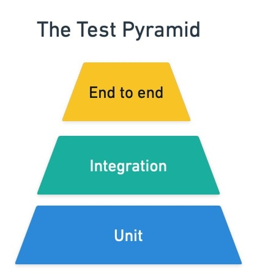

# Conceptos varios sobre programación

## SOLID

Los principios SOLID son un conjunto de reglas que nos ayudan a diseñar software que sea fácil de mantener y extender.

Sus siglas equivalen a:
- **S**: Single responsability (Responsabilidad Unica): Se refiere a que cada funcion o clase tiene que tener un unico cometido

- **O**: Open-Close

- **L**: Liscov Principle

- **I**: Inteface segregation

- **D**: Dependency inversion (inversion de dependencias): Es evitar que tu programa dependa directamente de las APIs y que hacer que tu programa dependa de una interfaz de la cual depende tambien la API.

## API

Las siglas de API se refieren a Aplication Programing Inteface, ...

### REST

Las APIs REST son APIs las cuales no almacenan nungun dato sobre consultas anteriores y todo lo que se requiere de la consulta

## Piramid Testing

La piramide del testing es una piramide que incluyen test Unitarios, Integracion y End to End. Es una piramide debido a cuanto mas abajo hay mas cantidad.

### Unitarios
Los test unitarios se realizan sobre una funcion o clase en concreto y no dependen de nada mas.

Se usan para probar corner cases, es decir, casos que extremos que no se suelen dar en la vida real pero que pueden ocurrir.

### Integracion
Son test que integran varias partes del codigo y qute todas en conjunto funcionan correctamente.

### End to End
Los test End to End son test que testean la aplicacion desde inicio a fin, probando todas las funcionalidades de la aplicacion.

# Libreria vs Framework
La diferencia entre una libreria y un framework es que la libreria la aplicas en tu codigo teniendo el control sobre ella y en el framework aplicas tu codigo al framework y no tienes control sobre el.

# BigO Notation

# ACID

Son los principios SOLID para Bases de DAtos.

- **A**: atomicity, las acciones quese realizan en una base de datos tienen que ser atomicas, es decir no se pueden quedar transacciones a medias.

- **C**: Consistency: Dado el mismo escenario una transaccion simpre ha de dar el mismo escenario.
- **I**: Isolation: Aislamiento: 

# Monolitico

Es un software que todo se está ejecutando en un mismo servidor, es decir tanto la BD, como la API como todo están en el mismo lugar.